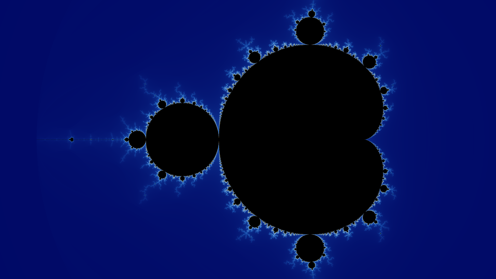
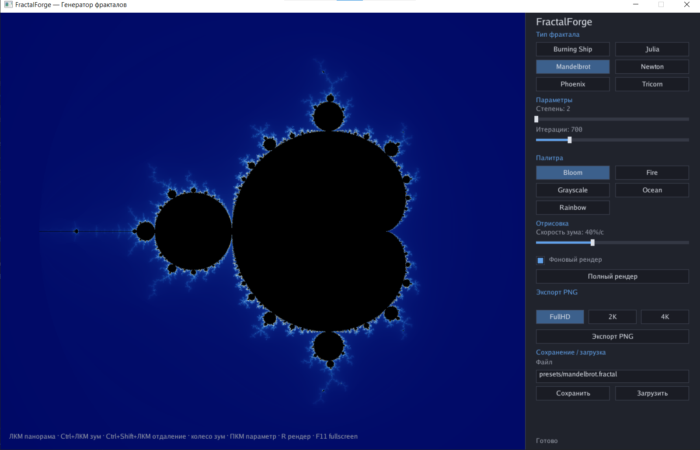

# FractalForge — генератор и исследователь фракталов



Интерактивный генератор и исследователь фракталов на **Go** + **[Ebitengine](https://ebitengine.org/)**.

Исследуйте классические фракталы, путешествуйте по комплексной плоскости в
режиме реального времени и погружайтесь в бесконечно глубокий зум благодаря
высокоточному рендерингу.

## Возможности

- **6 встроенных фракталов:** множество Мандельброта, множество Жюлиа, Burning Ship, Ньютон, Трикорн (Mandelbar), Феникс
- **Настраиваемые параметры** для каждого фрактала — степень, значения констант, палитра
- **Плавная навигация в реальном времени:** панорама мышью, зум колесом
- **Непрерывный фоновый рендер** — изображение обновляется во время движения, а не только после остановки
- **Режим автоматического зума**, переключаемый горячими клавишами
- **Полноэкранный режим** (F11) — холст занимает весь экран, боковая панель скрывается
- **Глубокий зум с произвольной точностью** — автоматическое переключение на высокоточный (big.Float) рендер, когда уровень приближения выходит за пределы чисел с плавающей запятой
- **Несколько цветовых палитр** с редактором внутри приложения
- **Экспорт в PNG** — пресеты Full HD, 2K и 4K
- **Сохранение и загрузка сцен** (JSON) — возвращайтесь к любимым видам

## Скриншоты

| Интерфейс | Приближение |
|-----------|-------------|
|  |  |

## Управление

| Действие | Клавиши / Мышь |
|----------|----------------|
| Панорама | Левая кнопка мыши |
| Приближение / отдаление | Колесо мыши |
| Авто-зум (приближение) | Ctrl + левая кнопка мыши |
| Авто-зум (отдаление) | Ctrl + Shift + левая кнопка мыши |
| Выбор точки параметра / отдельное действие | Правая кнопка мыши |
| Полный перерендер | R |
| Полноэкранный режим | F11 |

## Сборка

Требуется **Go 1.26+**.

```sh
go build -o fractalforge .
```

## Запуск

```sh
go run .
```

## Структура проекта

```
internal/
  fractal/    определения фракталов и реестр
  renderer/   попиксельный рендеринг (float и высокоточный путь)
  ui/         интерфейс Ebitengine: холст, боковая панель, виджеты, экспорт
presets/      встроенные пресеты сцен
```

## Лицензия

MIT